# Campus Flow Web Service and Deployment Report

**Name:** ZHU FUXIN / シュフシン  
**Student ID:** M25W7195  
**Project Title:** Campus Flow  
**Assignment:** Web service, OAuth/TLS, Docker image, and Azure deployment

## Introduction

This report explains my Campus Flow project, including the idea, implementation, test process, screenshots, and final result. The project is a small student daily-life dashboard. It combines a resume/profile page with useful information such as weather, country details, and daily tips.

The main purpose of the project is to build a web service that calls public web services, combines the returned information, and provides a browser-based frontend client. The system also includes OpenAPI documentation so the API can be tested directly in a browser.

## Idea and Implementation

The first idea was to make a resume page, but a static resume page was too limited for this assignment. I changed the project into a student dashboard. The Home page can search by country and city, and the Me page can save resume profile data into MySQL.

The backend is implemented with Spring Boot. It provides endpoints for homepage data and profile data. The frontend is written with HTML, CSS, and JavaScript. MySQL is used for profile persistence.

Two public web services are used:

- REST Countries: country name, capital, region, population, languages, and currency.
- Open-Meteo: city coordinates and current weather data.

The backend combines these two services in `/api/home`, so the frontend receives one fused result instead of calling both services separately.

For the TLS and OAuth requirement, I added HTTPS local testing and OAuth 2.0 login support. The local HTTPS address is `https://localhost:8443`. For OAuth APIs, the project uses Google Calendar API and GitHub API. Google Calendar is used to read calendar event information after Google login. GitHub is used to read profile and repository information after GitHub login, which fits the resume/profile purpose of this project.

## Main Improvements

During testing, I found that the old Home page depended too much on profile data. If the profile data was not loaded correctly, the Home page also became unreliable. I changed the logic so the Home page has its own country and city inputs. This allows the Home page to work immediately after opening the site.

I also checked the profile update flow. The profile page now sends updates to the backend, the backend writes the result into MySQL, and the frontend shows a clear save message. The API response also returns `saved: true`, which makes the test result easier to verify.

Japanese text was also checked because the resume name uses Japanese characters. The browser displays the name correctly. Some command-line tools may show mojibake because of terminal encoding, but the web page and API JSON display the Japanese text correctly.

## API Endpoints

The project documents these endpoints in OpenAPI format:

- `GET /api/home`
- `GET /api/home?country=Japan&city=Tokyo`
- `GET /api/profile`
- `POST /api/profile`
- `POST /api/authenticate`
- `GET /api/verify`
- `GET /api/student-area`
- `GET /api/teacher-area`
- `GET /api/admin-area`
- `GET /api/oauth/github/profile`
- `GET /api/oauth/github/repos`
- `GET /api/oauth/google/calendar`

The API documentation page is:

```text
http://localhost:8080/api-docs.html
```

For HTTPS/OAuth testing, the browser URL is:

```text
https://localhost:8443/index.html
```

OAuth callback URLs:

```text
https://localhost:8443/login/oauth2/code/github
https://localhost:8443/login/oauth2/code/google
```

## TLS and OAuth Test Plan

The OAuth test process is:

1. Open the site with HTTPS.
2. Click `Login` in the sidebar user card.
3. Choose GitHub in the login dialog.
4. Authorize the Campus Flow GitHub OAuth App.
5. Open `/api/oauth/github/profile` and `/api/oauth/github/repos`.
6. Click `Login` again and choose Google.
7. Authorize Google Calendar readonly access.
8. Open `/api/oauth/google/calendar`.

The expected result is that each protected API only returns data after OAuth login. This proves that the application is using OAuth authorization and not only public API calls.

## Test Process and Screenshots

### Figure 1: Postman GET Test for Homepage Data

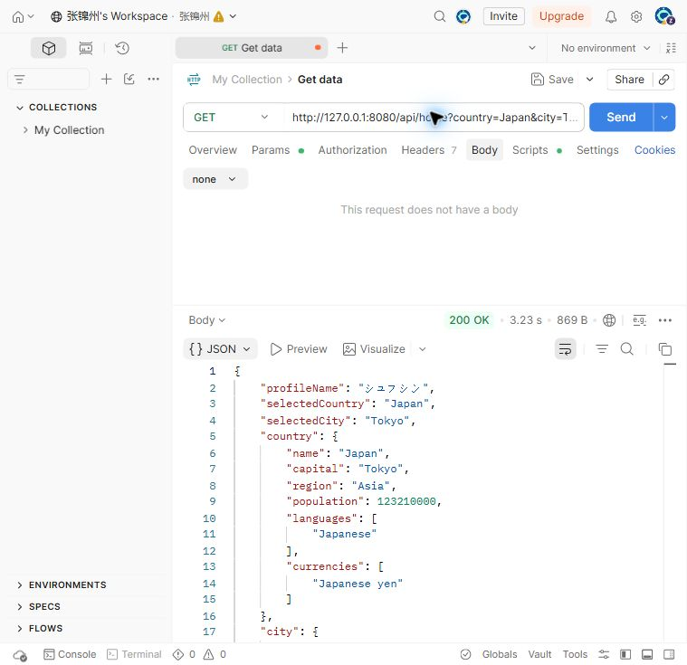

Figure 1 shows the Postman Web test for `GET /api/home?country=Japan&city=Tokyo`. The response status is `200 OK`, and the JSON result includes `selectedCountry`, `selectedCity`, country information, city information, weather data, and daily tips. This proves that the backend can combine public API results and return them through one endpoint.

### Figure 2: Postman POST Test for Profile Update

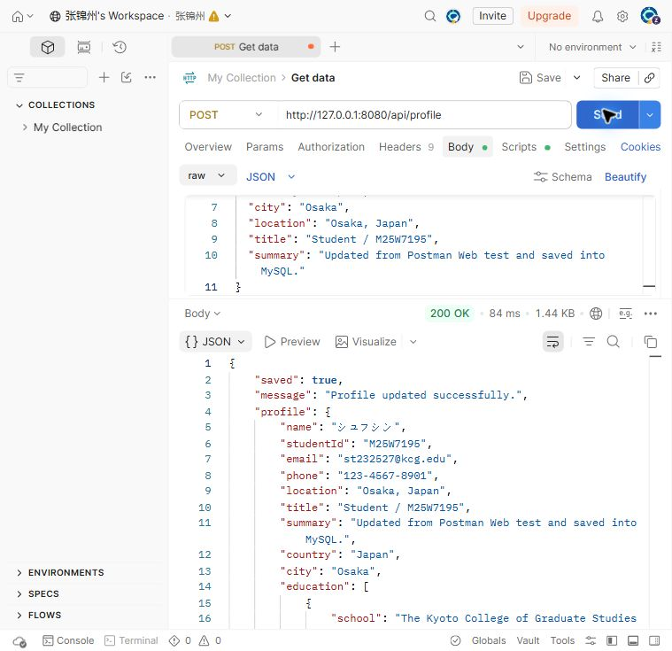

Figure 2 shows the Postman Web test for `POST /api/profile`. I changed the profile city to `Osaka` during this test. The response returned `saved: true`, which means the backend accepted the request and saved the profile data. This was an important step because it tested real data update behavior, not only page display.

### Figure 3: API Docs GET Test

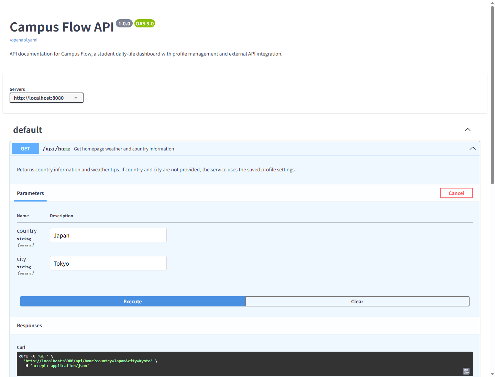

Figure 3 shows the browser-based API documentation page. In Swagger UI, I tested `GET /api/home` with country and city parameters. The response shows `200` and a JSON body with weather and country data. This confirms that the OpenAPI documentation is interactive and not only a static document.

### Figure 4: API Docs POST Test

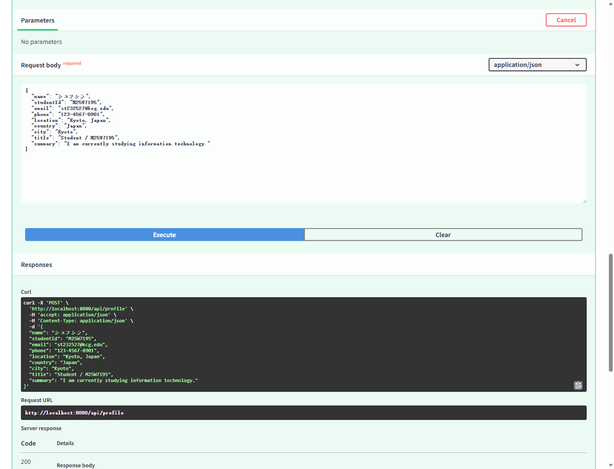

Figure 4 shows the Swagger UI test for `POST /api/profile`. The screenshot includes the POST request body, generated curl command, request URL, and the `200` response section. During the same test, the response body returned `saved: true` and `Profile updated successfully`, confirming that the API documentation page can also be used to update data.

### Figure 5: DBeaver Database Check

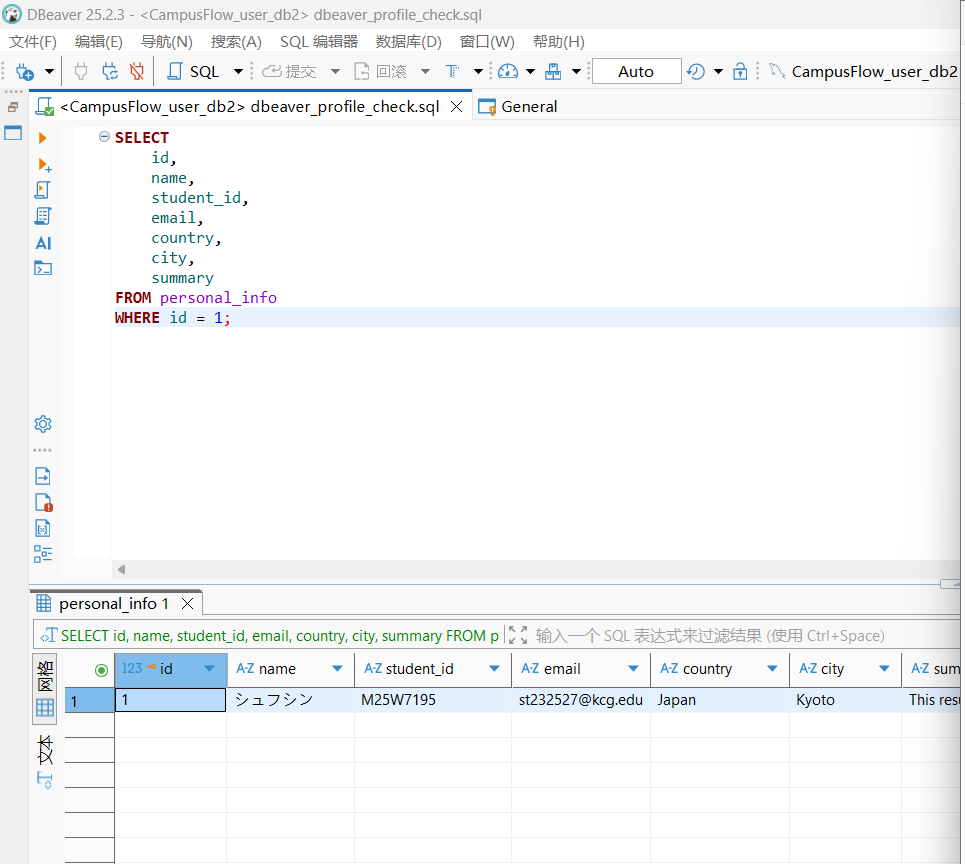

Figure 5 shows the DBeaver query result from the `personal_info` table. After updating profile data through the web/API flow, I checked the database directly. The row shows the saved country and city values, including `Japan` and `Kyoto`. This confirms that the update was persisted in MySQL and was not only stored temporarily in the frontend.

### Authentication Iteration

After completing the first version of Campus Flow, I added authentication based on the Week 8 security and authentication task. This iteration keeps the original frontend and profile/weather functions, and adds a simple login and role-based access control layer to the backend.

The authentication user data is stored in the existing `user_db2` database. I used a separate table named `auth_users` because the database already had other user-related data. The password values are stored as plain text because the assignment only required usernames, passwords, and user type, and did not require password hashing.

The default test users are:

| Username | Password | User type |
|---|---|---|
| student | pass | STUDENT |
| teacher | pass | TEACHER |
| admin | pass | ADMIN |

### Figure 6: Login Test in API Docs

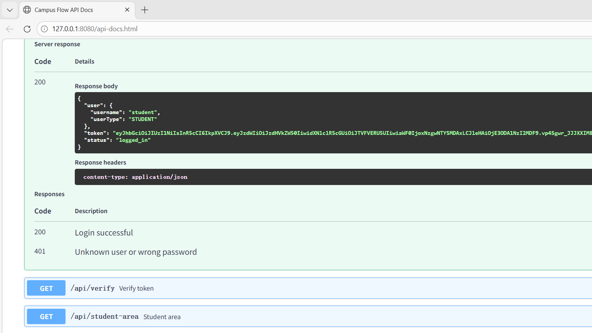

Figure 6 shows the Swagger UI test for `POST /api/authenticate` using the `student` account. The response returned status code `200`, a token, `logged_in`, and the `STUDENT` user type.

### Figure 7: Token Verification Test

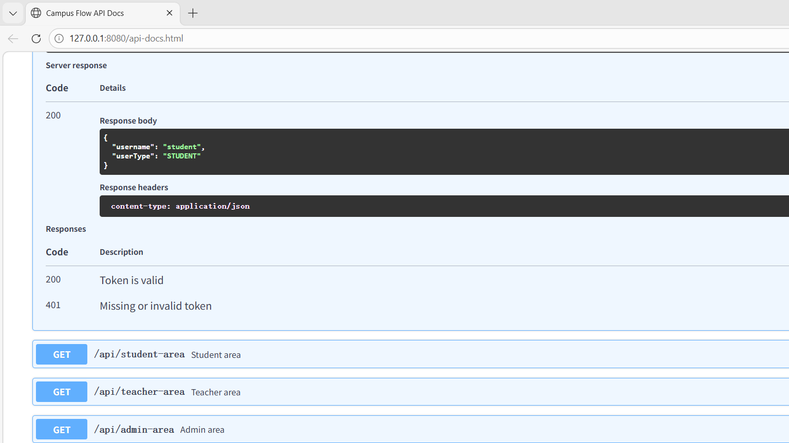

Figure 7 shows `GET /api/verify` after authorizing Swagger UI with the student token. The response returned `200`, `username: student`, and `userType: STUDENT`, confirming that the token can be verified by the backend.

### Figure 8: Student Permission Test

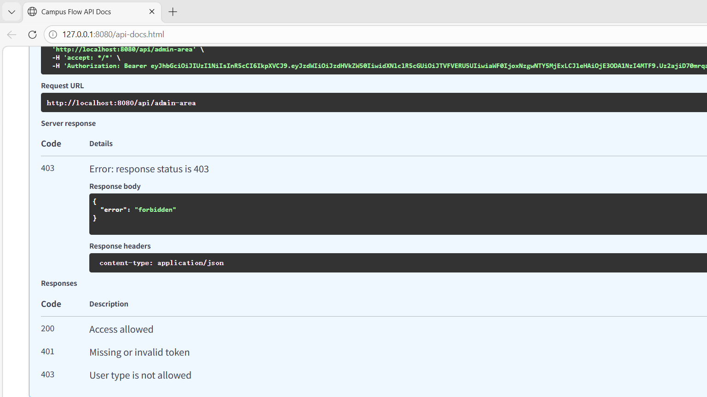

Figure 8 shows that a `STUDENT` user cannot access `GET /api/admin-area`. The endpoint returned `403` and `forbidden`, which proves that a logged-in user cannot automatically access every protected endpoint.

### Figure 9: Teacher Permission Test

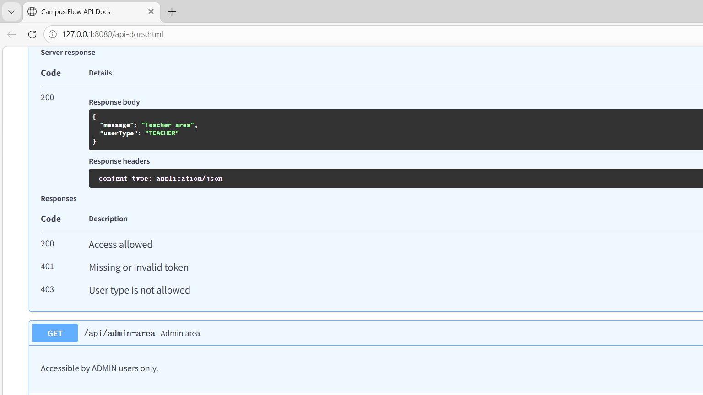

Figure 9 shows that a `TEACHER` user can access `GET /api/teacher-area`. The response returned `200`, `message: Teacher area`, and `userType: TEACHER`.

### Figure 10: Admin Permission Test

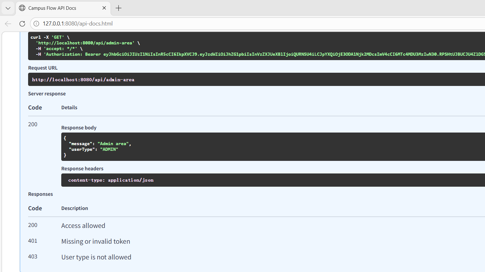

Figure 10 shows that an `ADMIN` user can access `GET /api/admin-area`. The response returned `200`, `message: Admin area`, and `userType: ADMIN`. Together with Figures 7 to 10, this confirms the authentication and role-based authorization flow.

The following screenshots are added for the final TLS and OAuth version. The original API, database, and JWT authentication test flow above is kept as the base test process.

### Figure 11: Final Home Page

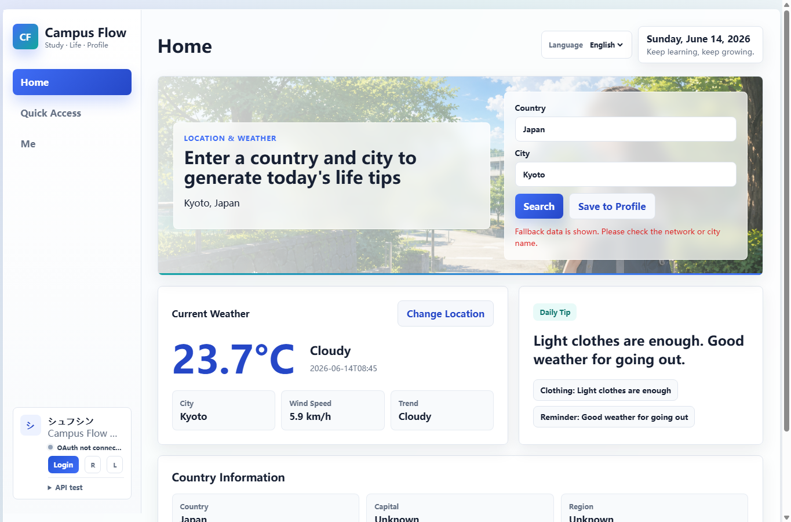

Figure 11 shows the final Home page. The page can search by country and city, and it displays weather, country information, and daily tips. The visual style is kept light so the page still feels like a campus-life tool, but the main point is that the deployed web app can be opened and tested clearly.

### Figure 12: Final Profile Page and Login Status

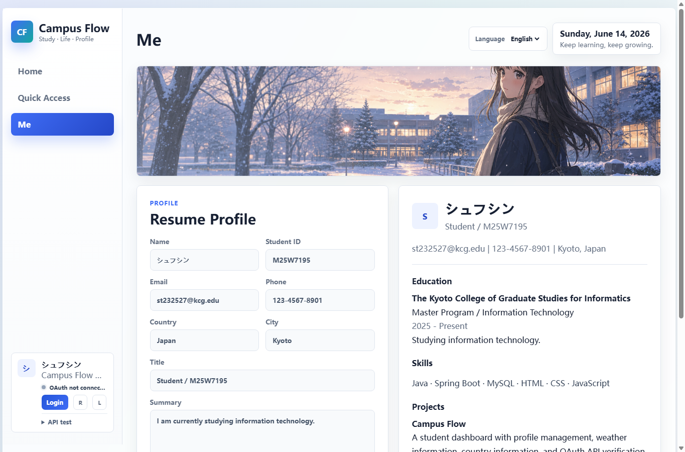

Figure 12 shows the final Profile page. The resume profile still keeps the original default content, including the Japanese name, student ID, email, phone, and summary. The OAuth login status is placed in the sidebar user card, so it does not take over the resume layout.

### Figure 13: OAuth Login Selection Dialog

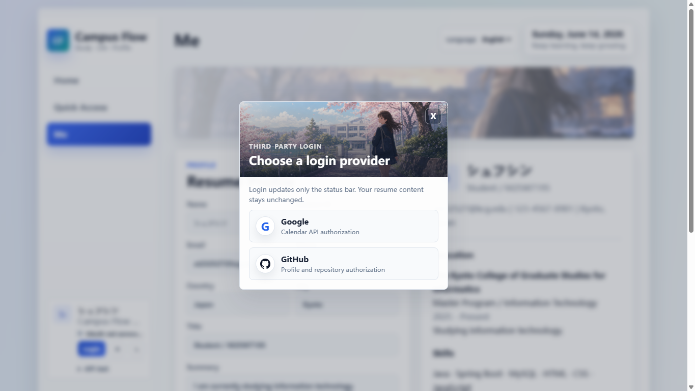

Figure 13 shows the login selection dialog. After clicking the Login button in the sidebar, the user can choose Google or GitHub. The dialog is small and centered, and it uses the same visual style as the final frontend.

### Figure 14: GitHub OAuth Success

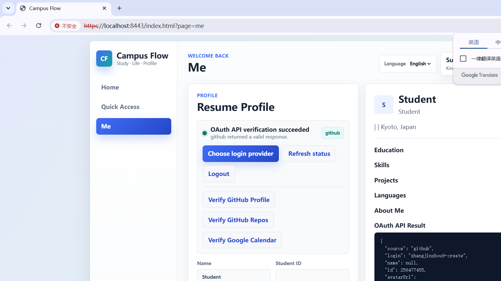

Figure 14 shows the GitHub OAuth result. After GitHub login, the sidebar login status changes to a successful state and the GitHub API can return profile information. This confirms that the GitHub OAuth flow and protected GitHub API call work.

### Figure 15: Google Calendar OAuth Success

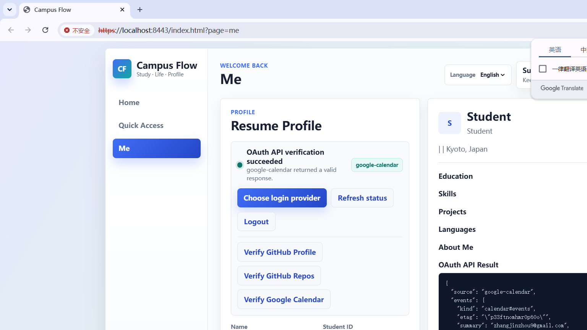

Figure 15 shows the Google Calendar API result after Google login. The application uses OAuth authorization and then calls the Google Calendar endpoint. This confirms the second OAuth API required by the assignment.

### Docker and Azure Deployment

For the deployment assignment, I kept the same Campus Flow project and created a Docker image for it. Because the project uses MySQL, I also prepared Docker Compose with an application container and a MySQL sidecar container. This part was useful because it made the database connection easier to explain: inside Docker Compose, the application connects to the database by using the service name `mysql`, not `localhost`.

The Docker Hub repository used for this assignment is:

```text
https://hub.docker.com/r/berhish/campus-flow
```

The Azure App Service URL used for the online test is:

```text
https://campusflow-dzh5b4fteeczf7ab.japanwest-01.azurewebsites.net/index.html
```

### Figure 16: Docker Desktop Sidecar Containers

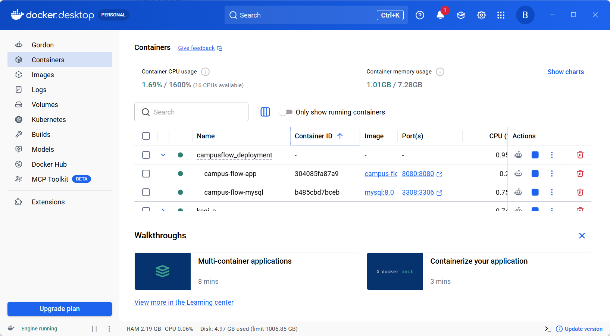

Figure 16 shows Docker Desktop running the Campus Flow deployment group. The important point is that `campus-flow-app` and `campus-flow-mysql` are both running. This confirms the local sidecar-container setup required when the project uses an external database.

### Figure 17: Azure App Service Configuration

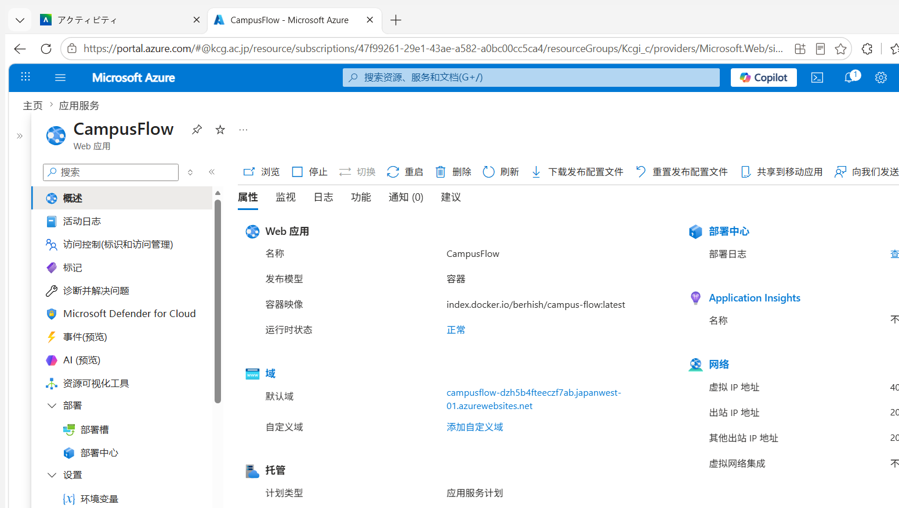

Figure 17 shows the Azure App Service overview. The web app is named `CampusFlow`, the publish model is container, and the container image is `index.docker.io/berhish/campus-flow:latest`. This is the part that connects the Docker Hub image with Azure App Service.

### Figure 18: Azure Online Frontend Test

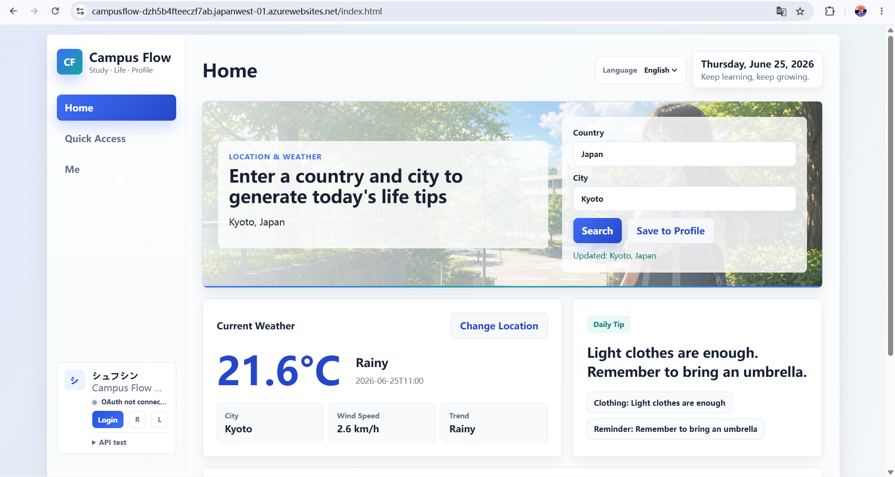

Figure 18 shows the deployed Campus Flow frontend opened from the Azure URL. The page loads, the location form works, and the weather/country result is displayed. This proves that the containerized web app can be opened online, not only on localhost.

### Figure 19: Docker Hub Image Tags

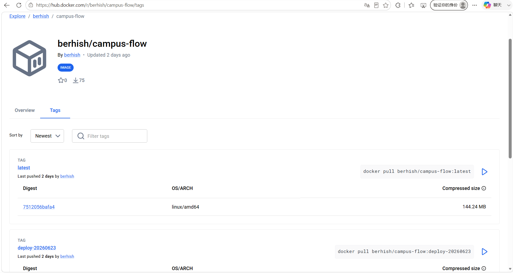

Figure 19 shows the Docker Hub repository `berhish/campus-flow`. The `latest` tag and the `deploy-20260623` tag are visible, and the page also shows the pull command. This screenshot is the public reference for the Docker image used by Azure.

### Figure 20: Azure Online API Test

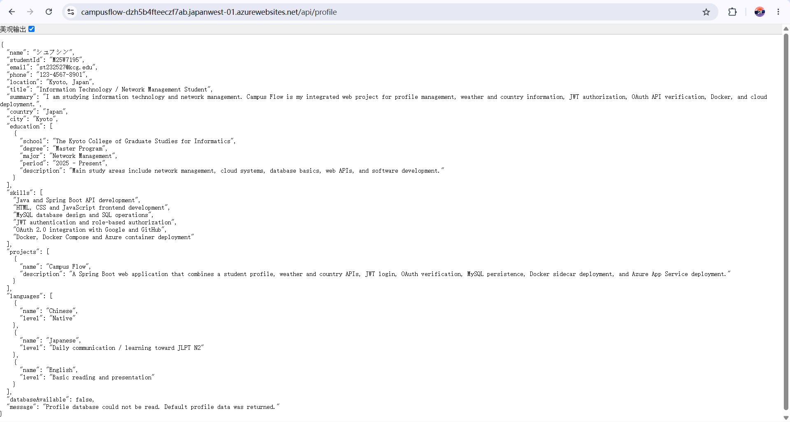

Figure 20 shows the online `/api/profile` endpoint opened from the Azure App Service URL. The API returned a readable JSON response with my profile information. The response also says `databaseAvailable: false`, so I understood that the deployed container could still return fallback profile data even when the cloud-side database connection was not available. For this assignment, this still proves that the deployed web app and API endpoint are reachable online.

## Experimental Result

The final test result is summarized below.

| Test item | Expected result | Actual result |
|---|---|---|
| Open frontend | Dashboard loads in browser | Passed |
| Search homepage data | Country and weather data are returned | Passed |
| Test GET in Postman | JSON response with fused data | Passed |
| Test POST in Postman | Profile update returns `saved: true` | Passed |
| Test API Docs | GET and POST can be executed in browser | Passed |
| Check database | Updated data exists in MySQL | Passed |
| Check Japanese text | Japanese name displays correctly in browser | Passed |
| Create authentication users | Three user types are stored in MySQL | Passed |
| Login with username and password | JWT token is returned | Passed |
| Verify token | Username and user type are returned | Passed |
| Student endpoint permission | STUDENT can access student endpoint | Passed |
| Teacher endpoint permission | TEACHER can access teacher endpoint | Passed |
| Admin endpoint permission | Only ADMIN can access admin endpoint | Passed |
| Unauthorized role access | STUDENT cannot access admin endpoint | Passed |
| Open HTTPS site | Site opens with local TLS profile | Passed |
| GitHub OAuth login | User can authorize and return to the app | Passed |
| GitHub API test | Profile/repository data can be requested after login | Passed |
| Google OAuth login | User can authorize Google Calendar readonly access | Passed |
| Google Calendar API test | Calendar endpoint returns an OAuth-protected response | Passed |
| Final frontend layout | Resume content, login status, and classroom-friendly visual style display correctly | Passed |
| Docker image build | Spring Boot app can be packaged into a Docker image | Passed |
| Docker Compose sidecar test | App container and MySQL sidecar container run together | Passed |
| Docker Hub image | `berhish/campus-flow:latest` is available as the deployment image | Passed |
| Azure App Service | Azure uses the Docker Hub image and shows the app as running | Passed |
| Azure frontend test | Online Campus Flow page opens from the Azure URL | Passed |
| Azure API test | Online `/api/profile` returns readable JSON; database fallback is handled | Passed |

## Reflection

The most useful part of this project was finding the difference between a page that only looks correct and a page that really works. At first, the frontend could display some information, but the logic was not complete enough. The Home page depended too much on profile data, and data persistence was not clear.

After testing with Postman, API Docs, and DBeaver, the data flow became clearer: the browser sends a request, Spring Boot handles it, MySQL stores it, and the frontend reads the saved result again. This made the project feel more complete and easier to explain.

The authentication iteration also helped me understand the difference between authentication and authorization. Authentication checks who the user is by login and token verification. Authorization checks what the user type is allowed to access. In this project, `STUDENT`, `TEACHER`, and `ADMIN` users share the same login flow, but they receive different access results for protected endpoints.

The OAuth part was more difficult than the normal public API calls because the application had to be registered with each provider first. I had to set the callback URL correctly, use HTTPS for local testing, and keep client secrets outside the source code. After this setup, the browser login flow became easier to test and explain.

## Conclusion

Campus Flow satisfies the assignment requirements. It provides a web service, a web frontend client, TLS local testing, OAuth login, integration with external APIs, OpenAPI documentation, Docker deployment, and a report with real screenshots from the test process. The final version also supports profile persistence, independent homepage search, JWT authentication, role-based protected endpoints, GitHub API verification, Google Calendar API verification, and a Docker Compose deployment with a MySQL sidecar container. For the deployment task, the important reference URLs are the Docker Hub repository `https://hub.docker.com/r/berhish/campus-flow` and the Azure App Service URL `https://campusflow-dzh5b4fteeczf7ab.japanwest-01.azurewebsites.net/index.html`.
